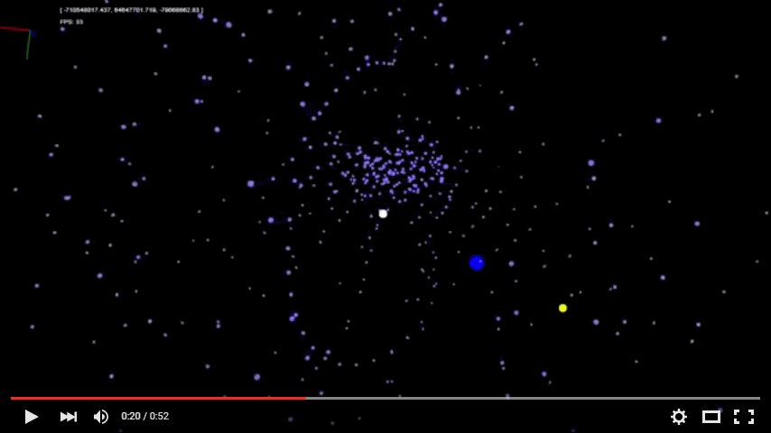

Particle
========

This is a javascript demo that renders particles in the magnetic field between the earth and the moon.

The simulation part is a port of Emelie Holm's thesis on the movement of particles in the magnetosphere. It uses Tsyganenko's External Field Model to calculate the movements of particles.

Instructions
------------
Open index.html in a browser.

Controls
--------
* WSADQE - Move viewport forward, backward, left, right, down, up. Hold shift key to move faster.
* X - Reset viewport position to default.
* IK - Change viewport yaw.
* LJ - Change viewport pitch.
* OU - Change viewport roll.
* C - Clear all particles from simulation.
* V - Spawn particles in a grid pattern around the moon. 
* B - Spawn particles in a circle pattern around the moon. Consecutive keypresses will change spawned particle mass.
* N - Spawn particles in a circle pattern with a larger radius than 'B'.
